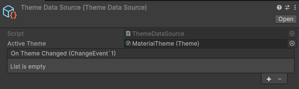
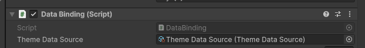
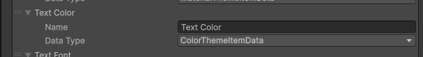
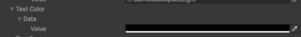
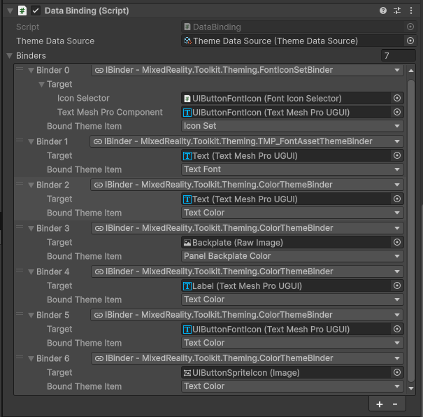

# MRTK Theming 3.0

## Getting started

This package works as a light data-binding system, binding theme values to components in the scene. A "theme" is made up of two parts, each containing several important pieces:

1. Theme data source
    1. Theme definition
        1. Theme item data
1. Theme
    1. Theme items

It is then applied to a GameObject using the _data binding_ component.

1. Data binding
    1. Theme binder

## Theme data source

A _theme data source_ is the source of truth for the current active _theme_. All mapped UI will have a reference to this source and will be informed when the current active _theme_ changes.

TODO: Maybe this should be MRTK global?

It also contains the _theme definition_, ensuring that only relevant themes are able to become the active theme for this source.

### Theme definition

A _theme definition_ defines a mapping of string names to _theme item data_ types.

#### Theme item data

An implementation of the _theme item data_ type specifies the type (e.g. color, string, font, or sprite) that can be bound to a specific value based on the theme. For example, `ColorThemeItemData` allows for one theme to set text to yellow, while another theme might choose blue text.

These types are defined in code using the base class `BaseThemeItemData<T>` and passing their mappable type as the generic type. They are then mapped and used entirely within the various theme scriptable objects.

## Theme

A _theme_ is assigned a _theme data source_ (to access its _theme definition_) and can then map all of the _theme item data_ types to concrete values.

The inspector will automatically be filled in with the _theme item data_ entries defined by the _theme definition_, providing an assignable slot for the value.

## Data binding

The _data binding_ component allows for a _theme data source_ to be assigned. The component then provides the ability to map a _theme item data_ entry directly to its target. For example, assigning a text component to the `Text Color` mapping causes that text's color to update according to the current theme. This mapping is defined by _theme binders_.

### Theme binder

A theme binder maps a component type to a data type (e.g. a color to a graphic or a vector3 to a transform).

These types are defined in code using the base class `BaseThemeBinder<T, K>` and passing their mappable types as the generic types. They are then mapped and used entirely within the various theme scriptable objects.

